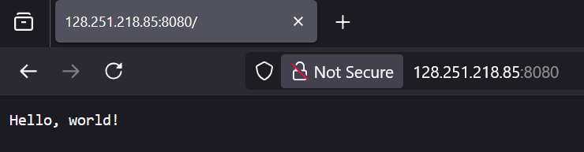
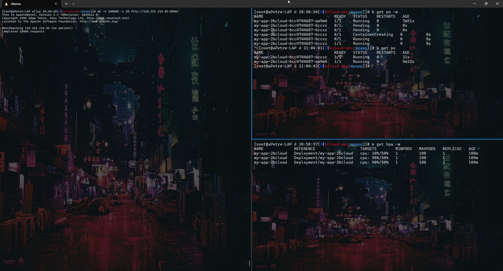
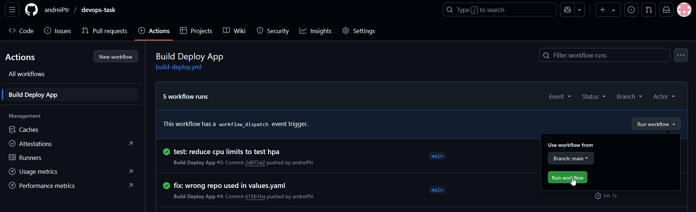

# DevOps-tasks

# 1.Infrastructure Provisioning

**Set up container registry:**
I used the following resources to provision an Azure Container Registry:
[Microsoft Documentation](https://learn.microsoft.com/en-us/azure/container-registry/container-registry-get-started-terraform?tabs=azure-cli) and [Terraform-Registry](https://registry.terraform.io/providers/hashicorp/azurerm/latest/docs/resources/container_registry).

Implementation steps:
- Created terraform folder with `main.tf`, `variables.tf`, `output.tf`, `registry.tf`, and `providers.tf`
- Added in `providers.tf` the azurerm provider. As I couldn't add a App registration for some credentials used az login to be able to plan/apply the terraform manifests. Got some errors about registration and that's why I added the `resource_provider_registrations = "none"` part in the provider.
- Configured Azure Container Registry resource in `registry.tf`
- Configured the variables and outputs in their specific files.
- Tested it with `terraform validate` and `terraform plan`.

**Set up storage account:**
I used the following resources to provision an Azure Container Registry:
[Microsoft Documentation](https://learn.microsoft.com/en-us/azure/developer/terraform/store-state-in-azure-storage?tabs=terraform) and [Terraform-Registry](https://registry.terraform.io/providers/hashicorp/azurerm/latest/docs/resources/storage_account).

Implementation steps:
- Created and applied `storage-acc.tf` with required resources
- Set up `backend.tf` with storage account configuration
- Migrated tfstate to Azure Storage with `terraform init`


**Set up AKS:**
I used the following resources to provision an Azure Container Registry:
[Microsoft Documentation](https://learn.microsoft.com/en-us/azure/aks/learn/quick-kubernetes-deploy-terraform?pivots=development-environment-azure-cli) and [Terraform-Registry](https://registry.terraform.io/providers/hashicorp/azurerm/latest/docs/resources/kubernetes_cluster).

Implementation steps:
- Created and configured `kubernetes.tf`
- Added Kubernetes provider to `providers.tf`
- Applied configuration with `terraform apply`
- Went on the UI and got the following commands that I used to test that I can access the cluster:
```bash
az account set --subscription <subscriptionID>
az aks get-credentials --resource-group <resourceGroup> --name <clusterName> --overwrite-existing
```

**TO DO**
- set up pipeline to take care of the manual part.

# 2.Basic Web Application
A lightweight Go web server with the following features:
- Listens on port 8080
- Health check endpoint at `/healthz`
- Simple HTTP response handling
- Located in `app/main.go`


# 3.Containerization
The application uses a multi-stage Docker build for optimization:
- Base image: distroless
- Significant improvements:
  - Size reduction: 1GB+ → ~20MB
  - Vulnerabilities: 916 → 0
  - Eliminated: 95 high and 1 critical vulnerabilities
- Dockerfile location: `app/Dockerfile`


# 4.CI/CD Pipeline for Application
GitHub Actions workflow that:
- Triggers on push to main branch
- Creates container image
- Pushes to Azure Container Registry
- Trivy security scanning
- Deploys to AKS

Configuration:
- Enabled ACR admin user
- Set up registry credentials as secrets
- Added registry URL as environment variable
- Generated kubeconfig:
```bash
az aks get-credentials --resource-group <resourceGroup> --name <clusterName> --file kubeconfig.yaml
```
Then set it also as a secret. Wanted to use App registration and setting a json file with AZURE_CREDENTIALS but didn't had rights to add a role assignment.


# 5.Application Verification
Verification steps include:
- A kubectl rollout status on the deployment
- A curl to the healtcheck endpoint
- Load balancer access validation



Issues encounterd:
- Forgot to add dependencies between jobs
- Forgot to change default registry
- Wrong values used in values.yaml
- All issues are in the git history with commit message begining with fix:

# Bonus: HPA (Horizontal Pod Autoscaler)
Configuration details:
- Auto-scaling based on CPU usage
- 50% CPU threshold defined in values.yaml
- Verified with Apache Bench testing
- Successful scaling demonstrated



## Project Structure

```
devops-task/
├── app/
│   ├── Dockerfile
│   ├── go.mod
│   ├── main.go
│   └── 2bcloud/           # Helm chart
├── terraform/
│   ├── backend.tf
│   ├── kubernetes.tf
│   ├── main.tf
│   ├── output.tf
│   ├── providers.tf
│   ├── registry.tf
│   ├── storage-acc.tf
│   └── variables.tf
└── .github/
    └── workflows/
        └── build-deploy.yml
```

## Prerequisites
- Azure CLI
- Terraform
- Docker
- kubectl
- Helm

## Getting Started

1. **Azure Authentication**
```bash
az login
```

2. **Infrastructure Deployment**
```bash
cd terraform
terraform init
terraform apply
```

3. **Application Deployment**
- Automated via GitHub Actions on main branch pushes/PRs
- Manual trigger available through workflow_dispatch
